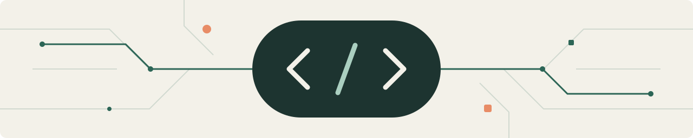

<picture>
  <source media="(prefers-color-scheme: dark)" srcset="assets/header-dark.svg">
  
</picture>

# Mazen El Deeb

### Software Engineer

**Useful software. Thoughtful engineering.**

I build **mobile and web applications**, integrate APIs, and automate workflows that solve practical problems. I care about clear interfaces, dependable behavior, and code that is easy to understand and maintain.

[**LinkedIn ↗**](https://www.linkedin.com/in/mazen-eldeeb/) &nbsp; · &nbsp; [**Upwork ↗**](https://www.upwork.com/freelancers/mazene36)

## My toolkit

  
  
  
  
  
  

- **Mobile application development:** Swift, Flutter, and React Native.
- **Web and backend development:** Next.js and NestJS.
- **Automation:** Workflow automation and API integration.

## What matters to me

- Solving the right problem before adding complexity.
- Building interfaces that feel clear and natural.
- Writing reusable, testable, maintainable code.
- Communicating clearly and following through.

---

**Top Rated on Upwork.** [Explore my client feedback](https://www.upwork.com/freelancers/mazene36).

**Let’s work together.** [Connect on LinkedIn](https://www.linkedin.com/in/mazen-eldeeb/) for engineering opportunities, or [reach me on Upwork](https://www.upwork.com/freelancers/mazene36) for freelance work.
